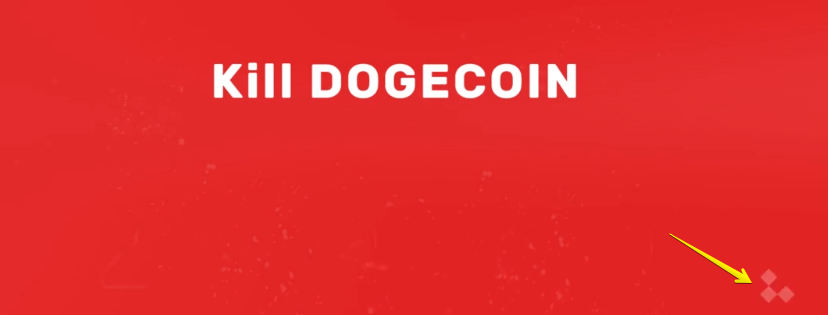

# Shiba Inu Token: Exposed 中文翻译

https://shibaexposed.wordpress.com/2021/05/22/shiba-inu-token-exposed/

仅为文章的简单中文翻译  
不构成投资建议  
真假请自行判断  

以下为翻译的内容

<!-- @import "[TOC]" {cmd="toc" depthFrom=2 depthTo=6 orderedList=false} -->

<!-- code_chunk_output -->

- [介绍](#介绍)
- [Shiba Inu 的诞生](#shiba-inu-的诞生)
- [ShibaSwap](#shibaswap)
- [Leash token](#leash-token)
- [SHIB 和 LEASH 币今天有多大呢？](#shib-和-leash-币今天有多大呢)
- [谁参与了](#谁参与了)
- [在我们进入细节之前，为什么我现在发布这篇文章？](#在我们进入细节之前为什么我现在发布这篇文章)
- [Leashdoge.com](#leashdogecom)
- [公司 "H"](#公司-h)
- [证明 ShibaSwap 在四月底前不存在](#证明-shibaswap-在四月底前不存在)
- [更多的元数据分析](#更多的元数据分析)
- [5 月 19 日前 ShibaSwap 还不存在的证明](#5-月-19-日前-shibaswap-还不存在的证明)
- [人物 "ECS"](#人物-ecs)
- [ECS Team Ltd - 第一家位于 27 Old Gloucester Street 的公司](#ecs-team-ltd-第一家位于-27-old-gloucester-street-的公司)

<!-- /code_chunk_output -->

## 介绍

这是一个非常长的文章！

如果你读到了最后，你会看到：

1. ShibaSwap 完全不存在
2. 我很确定我已经确认了 Shiba 和 Leash 的创造者
3. 这些创造者已经从这个项目中获得了巨大的利益
4. 我们会一步步揭露真相

以下是一些对虚拟货币不了解的人的一点背景介绍：

Shiba Inu token 的故事可以说是和 Doge 紧密相连的。很多虚拟货币的交易者 - 新的和旧的 - 使用一种 “买小道消息，卖大新闻” 的策略。例如，Elon Musk 最近出现在了电视节目 "Saturday Night Live" 上。在他的这个出现的几周前，Doge 币曾经到达过 $0.70 的高度，这很明显的是来源于新进入到虚拟货币投资的人们。但是就当这个节目开始后，那些长期持有过 Doge 币的人们开始卖出并获得了很多的收益。Doge 在这之后就再也没有到达过 $0.70 了。  

当一个虚拟货币火了后，今本上一定会有它的模仿者出现。例如，"SafeMoon" 的出现就吸引了很多的关注和传播。在 SafeMoon 发布的几天内，"SafeMars" 出现了，然后 "SafeStar"，再然后更多的类似于 "SafeXYZ 这种火币相继出现。这些模仿货币的创造者希望他们可以借此获得类似于原本货币的关注，然后那些关注将会吸引新的买家/持仓者，以此来提高他们币的价格。他们利用了 "FOMO" 这种感情 - "害怕错过 Fear Of Missing Out"。

## Shiba Inu 的诞生

Shiba Inu - 或者 Shib - 最开始“官方”出现于 2020 年的 8 月 2 日的一名叫做 "Ryoshi" 的人写的一篇[博客](https://allhailtheshiba.medium.com/all-hail-the-shiba-an-experiment-in-decentralization-87e3792e92f2)。

在这篇博客文章上面有一张最初 Doge “吉祥物” 的图片，一个叫做 Kabosu 的狗狗。她是一种日本的叫做柴犬的狗狗。这张图片被文字 “Shiba: The Dogecoin Killer” 包围。  

这篇博客的内容不是很重要。博客的文笔使用了很多故意的孩子气的错误拼写，例如 “frens“ 而不是 ”friends“ 以及 ”poorboi“ 而不是 ”poor boy“。Ryoshi 写了他们是 ”很多年的虚拟货币的独立交易者，并且为去中心化社区的开端着迷“。他们重复地声明这里没有管理员币 - 意味着开发者只能自己从项目中自行购买来获利。

在这篇博客的最下面，列下了很多链接，显示了最初的 SHIB 被送给了一个叫做 “VB” 拥有的钱包（账号） - Vitalik Buterin，以太坊的创始人以及世界上最年轻的虚拟货币亿万富翁。这可看上去像是 VB 参与投资了这个项目，但是事实上这只是一个惯用的技俩来稀释货币 % 被其他钱包的拥有。在当时，很多人都认为 VB 自己没有操作那个钱包的权限 - 可能是因为他已经自己故意销毁了私钥所以他无法使用那个钱包，又或者那个私钥已经丢失在一个坏了很多年的硬盘里了。

这篇博客结尾使用了一张 VB（蓝绿色衣服）和他的很多朋友在日本的照片。我们一会儿再回来谈 VB。

我们总结如下：当 Doge 获得了名声后，SHIB 的诞生收益于类似狗币的模仿。SHIB 背后的团队保持匿名，但是留下了 VB 也参与了的暗示。  

## ShibaSwap

根据 SHIB 的白皮书，ShibaSwap 应该在 2021 年的四月底前就出现。但是到了五月的 22 号，它依然没有出现。这里没有证明说它甚至存在过。它的团队仍然生成延时是因为一个 “audit” 还在被进行。

## Leash token

Leash 是 Shib 的孪生兄弟。它本来应该在 ShibaSwap 中使用，被赋予了持有者更甚单独持有 SHIB 的好处。它的供给是有限的（107,647 个币相较于 SHIB 的几个兆），所以推广它的时候可以被概括为“在它被别人买了前赶紧买” - 又是使用了 FOMO 这种感情的技俩。  

## SHIB 和 LEASH 币今天有多大呢？

在这片文章编写的时候：

SHIB 现在拥有 76 亿美金的市值 - 这个比它最高时的 391 亿的市值少了许多，一部原因因为全球虚拟货币市场的下沉。这里有超过 419,000 个钱包持有了 SHIB - 真实的持有者数量可能会更多，因为这个钱包的数量不包括类似于币安的这种中心花交易所。SHIB 在币安上拥有每天 5 亿美金的交易量（我曾经看到它超过 10 亿美金一天的交易量）。它已经被币安以及众多其他的交易所上线（很令人震惊-这显示了很少的尽职调查有被做）。 

LEASH 拥有 2.32 亿美金的市值，超过 14,500 个持有者，并且每天的交易量超过 2000 万美金。它目前只在一些非常小的交易所上上线了，但没有像币安这种。这里有信息显示火币（一个大的交易所）可能在计划上线 LEASH，因为火币看上去在近期购买了差不多一百万美金的 LEASH。

这些数字看上去很疯狂，考虑到这两个币目前都没有落地的应用。它们的价值仅仅来源于被许诺的革命性的 ShibaSwap。

## 谁参与了

我将会使用一些人物/公司的简写。下面将会有一系列非常细节的证据的描述。如果你想要自己查询这些证据，也是非常简单的。如果你跟随线索线，你会发现他们的真实名字，但是我建议你不要真自己过于参与发现。

最主要的人物/公司有：

公司 “H” - 一个伊朗的软件开发公司，主要参与金融领域的开发。  

人物 “ECS” - 一个秘鲁人，现在可能生活在俄罗斯的莫斯科。他是一家位于英国伦敦的公司的领导人。他在虚拟货币中参与了许多。他现在是另一个币的 “CEO”。他的其他币以及伦敦的公司有着俄文的连接。  

人物 “SHR” - 一个西班牙人，现在也生活在西班牙。他是很多伦敦的公司的领导人。他也在虚拟货币中参与了很多。

这里还有一些其他的人和公司 - 一些下面列举了，一些没有 - 也可能参与了，但是这上面三个是我感觉最有关的。  

## 在我们进入细节之前，为什么我现在发布这篇文章？

虚拟货币世界中充满了欺诈(Scams)。他们一般不惊扰我。在一些程度上，我把他们视为“游戏”的一部分，一种权衡利弊 - 如果 DeFi（去中心化金融）领域有了去中心化的目标以及很少的政府干预，那么自然而然意味着相较于传统金融的更多的混乱，所以我们必须接受一些将会出现的坏的事情。但是我不是 DeFi 的死粉。整个领域都在非常小心的状态下。泛滥的欺诈在把人们吓跑。感觉就像我们是在庞氏骗局中一样。  

仅仅今天，几个小时之前，另一个 DeFi 货币叫做 Yeet 的归零了，留下了 16,300 个持有者丧失了一切。Yeet 的最高市值达到过 35,000,000 美金就在 11 天前的 5 月 11 日。reddit 上已经有过不止一篇说想要自杀的帖子了。

在 Yeet 事件的几个小时后，Bogged Finance 承受了某种攻击，导致所有价值被抹掉了。  

每周都有这种新的大欺诈和归零事件出现。  

SHIB 和 LEASH 已经走了很远，拥有了远远超过历史上其他虚拟货币骗局的持币者，也上线了很多类似于币安的交易所，甚至还有传闻说将会上线 Robinhood 以及 Huobi。在看过今天 Yeet 归零之后以及它对社区产生的极大的影响，我决定把我拥有的信息公开。人们不应该持续地因为这些寄生虫般的骗局而丢失掉他们的财产 - 这造成了伤心，无家可归，甚至可能是自杀。  

不是“我们人民”为我们自己抗争，就是政府将要开始管控 DeFi 并且更多地破坏它了。  

## Leashdoge.com

官方的 SHIB 网站（shibatoken.com） 以及 “woofpaper”（白皮书）很多次地提到了 LEASH，但是现在没有任何链接到 LEASH 的网站。但是，我们可以利用神奇的 "Way Back Machine"（web.archive.org）时间回溯网站来看看过去 SHIB 的网站长什么样子。

回到 2020 年 10 月 24 日，shibatoken.com 是被 Wix 托管的。下面是它的样子：

这里有很多有趣的事情。

首先，这里曾经有过一个 12 秒的名字为 “Buy $SHIB”（买 $SHIB）的视频。这个视频以就可以在[这里](https://video.wixstatic.com/video/04dd44_285fd0a948fc400d84eb59f3b3c837ae/720p/mp4/file.mp4) 观看。用那个链接观看全屏观看这个食品以及听音乐。记下音乐的风格，是“Jason Bourne”-风格的，还有 “白色的旋转的方块” 也被使用了。  

  

我们之后会回到这个视频。  

同时在 10 月 24 日的这个网站上，这里还有一个链接 “www.leashdoge.com”：

  

很有趣 - leashdoge.com 没有在 shibatoken.com 上被提及 - 这个链接已经被删除了。想要进一步证明 leashdoge.com 曾经被用于作为 LEASH 的官方网站，可以看看[Ryoshi 在 2021 年 2 月 1 号的这篇文章](https://allhailtheshiba.medium.com/the-ascension-of-shib-and-next-steps-for-leash-4aea97ea4f25)中提到了 leashdoge.com。

现在我们拥有了两个源头证明了 leashdoge.com 曾经是官方的一个域名。  

  

这个看上去挺差的，看上去也很就没有更新过了。  

这个网站的 DNS 记录显示了它被 thcservers.com 托管。这是一个非常便宜的网站托管。  

有些时候，软件开发者会在网站的代码中署名。例如，在 shibatoken.com 网站曾经使用了一个叫做 Nicepage.com 的工具，并且 HTML 代码包含了 `<meta name=”generator” content=”Nicepage 3.10.2, nicepage.com”>`。  

在 leashdoge.com 上，相似的代码也出现了，但是不是 nicepage.com，而是：

  

我给截图中的名字以及链接打了马赛克，但是这就是公司 "H"。我们继续去看这个链接。。。

## 公司 "H"

这是秘鲁版本的他们的网站首页：

  

（注意图中的紫色的椅子）  

这里还有个英文版本的网站：

所以，这是一家专注于金融/银行软件开发的公司。这是想要创造一个虚拟货币的很有用的技能。  

在主页上有一个视频，在我的感觉上 - 就风格而论 - 很像是过去在 shibatoken.com 上使用过的视频。  

首先，音乐不是很不同。  

视觉上，下面是对比：

<!-- comment -->

“扫把式”的特效：

“白色的旋转方块”：
  
  

这个视频显示了一个便签笔记 "create token" - 很像一个 DeFi 币？他们正在白板一个叫做 "DigiWallet" 的东西。  

  

这个视频显示了同样个紫色的椅子，和我们之前看到过的照片中出现的一模一样，确定了照片和视频都来自于同一家（真实的）公司。  

  

网站的 DNS 记录现实它被一家伊朗公司托管 - hostiran.net 和/或 arvancloud.com。

网站的 IP 是 5.144.130.32。这个 IP 出现在了有过网络犯罪的[黑名单](https://github.com/firehol/blocklist-ipsets/blob/master/hphosts_emd.ipset)中。  

这个网站使用了一个第三方的叫做 “OwlCarousel2” 的 JavaScript 库。我曾经在一家软件开发公司工作过很长的时间，并且从来没有听说过这么一个库，所以这个库的名字吸引了我的眼球。请记住这个信息 - 我们稍后还会回到这里。  

后来继续调查，这个网站的 Google Tag Manager ID 是 `GTM-P8K3VFF`，Google Analytics ID 是 `1637547337`，Hotjar ID 是 `1467398`，Raychat ID 是 `08463674-2545-49da-b533-e7638ef6d1e4`。  

我们可以概括为公司 H 是被签约建设 leashdoge.com （也 shibatoken.com 也可能是）的。  

我们可以继续推论在这家公司工作的某个人是 SHIB/LEASH 的创造者。在 Linkedin 上搜索在这家公司工作的人，我发现了他，一个管理领导：

  

在这个页面的底部有什么？一篇 2020 年 12 月 6 日，标题（写于秘鲁语和英语）为 “CrYptO CuRrEnCy -rise and fall” 的文章。  

这篇文章写于秘鲁语，并且和 Doge 以及 Shiba 没有关联。但是它确立了这个管理领导对虚拟货币的兴趣，并且这个文章的写作时间就是 Shiba Inu 项目开始的时间左右。  

  

在我的眼中，这个信息 - 特别是在 leashdoge.com 中隐藏在 HTML 里提到过的公司 H - 很明显地显示了公司 H 参与到了 LEASH 以及可能 SHIB 的项目中。  

让我们先不谈公司 H，让后继续看看其他的线索。  

## 证明 ShibaSwap 在四月底前不存在

回到 shibatoken.com。让我们使用时间回溯机器看看这个网站在 3 月 18 日的样子：

  

这看上去像是 ShibaSwap 的图形界面，但是做了模糊化处理，然后是一个标语 “spread the word to reveal the UI”（分享这句话来显示这个界面）。  

然后是在四月 2 日：

在这个界面下方，我们可以看到两张模糊的 ShibaSwap 的截图：

  

让我们用一个叫做 `exiftool` 的工具来查看下这些图片的元数据：

  

啊，这很奇怪。。。元数据显示这些模糊的图片是使用 Photoshop 在 3 月 9 日创建的。他不是一个浏览器中网站的真实截图。。。好，也许这只是在 3 月早期用 Photoshop 制作的图片，但是网站也是真的有的？

回到今天，这个网站有不再是模糊的图片了！

  

所以 ShibaSwap 真的存在？

别着急！

让我们看看黑暗模式下截图的元数据：

  

这里有很多有趣的东西。

首先，我们可以看到这不是网站的截图 - 因为这张图片是被 Mac 上的 Photoshop 版本 21 创建的。

当然，也可能是先拍了截图，然后再用 Photoshop 进行了编辑。但是... 底部的元数据是什么？ “Text Layer Name…. Capa 528…. New token woofing soon!… Select a token…” 这就是事情开始变得可疑了。一张网站的截图不应该拥有页面的文字在元数据中才对。这个界面肯定是使用 Photoshop 创建的，就像是 3 月 9 日的图片一样，并且 Photoshop 保存了图片文字层的内容在元数据中。

视觉上看，一个月了什么也没有变 - 仅仅是模糊被去掉了

然后是文字 "Capa 528" 是什么意思呢？它出现在了图片的元数据中而不是界面上。并且这里还有“Capa 38” 以及 “Capa 39”。后来我发现，“Capa” 在西班牙语中意味着 “Layer”（图层）。看看这个 [Photoshop 的帮助页面](https://helpx.adobe.com/es/photoshop/using/layer-basics.html)。  

  

所以我们现在可以说明他们团队声称的 ShibaSwap 的截图仅仅是用一台西班牙语上面的 Photoshop 制作的。  

但是很多国家也说西班牙语 - 西班牙，阿根廷，莫斯科。。。幸运的是，图片的元数据还揭露了编辑者的地理位置：

  

注意时间戳后面的 “+01.00” 以及 “+02:00” 。这些 UTC 的数值和西班牙相对应。在冬天以及 3 月早期，西班牙的时区是 UTC+1:00。在夏天，时区为 UTC+02:00。

更有趣的是这些图片的创建时间。记得 ShibaSwap 理应在四月底上线。但是被推迟了因为要做 "audit"。但是那个模糊的图片是在 3 月 9 日创建的，并且在 4 月 28 日取消了模糊。

有趣的是，shibatoken.com/img/home2.png 没有同样的 Photoshop 的元数据，但是很明显的是和过去那张的光亮模式下的界面是一样的，所以很明显这些图片被故意地消除掉了元数据来隐藏这个谎言。  

## 更多的元数据分析

这里有太多的可以写的信息，但是我只想写更多的一些文件来强调的观点。 

白皮书的 PDF 是被某人在 UTC+02:00 的时区，例如西班牙，创建的：

  

这里是一个来自于旧网站的的图片的链接：https://shibaexposed.files.wordpress.com/2021/05/0285a-04dd44_029f706ae81b4498b8cbaaf2f8fe9749mv2.png

  

  

看一下时间戳: September 3rd, 2020 (2020 年 9 月 3 日) - 正好是 Leash 的智能合约创建的后一天。看看使用的软件：Affinity Designer version 1.8.4.

这里是另外一张 Hotbit 的图片（Hotbit 是一个交易所 - 我没有说他们参与到了这个项目中）：  https://shibaexposed.files.wordpress.com/2021/05/cfcde-04dd44_ced2a1a62060450f9f2c1fc0860aa22dmv2.png

  

元数据：

  

有趣。。。这个图片是在 2 月 2 日使用 Affinity Designer version 1.8.5 创建的。可以几乎说明是同一个人在相隔了 5 个月后在同一台电脑上创建了这两张图片 - 并且只有 Affinity Designer 升级了下。  

阿，关于那个 `Little CMS` 呢？ 好吧。。。

## 5 月 19 日前 ShibaSwap 还不存在的证明

让我们先不管 `Little CMS`。

在 5 月 19 日，就在 ShibaSwap 理应上线的近一个月后，一张新的图片被发布到了 Twitter 和 Reddit 上，试图证明 ShibaSwap 正在被测试：https://www.reddit.com/r/SHIBArmy/comments/ng2xuh/shibaswap/

在这张图片的元数据有什么呢？`Little CMS`，当然又出现了：

  

想要看看这个 5 月 18 日的照片以及四月底的那张证明为 Photoshop 的照片？

  

这张新的图片不仅仅看上去是用 Photoshop 创建的，然后使用 Little CMS 进行了编辑。它还没有 ShibaSwap 理应有的功能，例如 Staking（质押）。什么？在这两个币下面甚至没有一个 “Swap”（交换）按钮。你如何交换两个币但是没有一个交换按钮？

现在我们知道了某个来自西班牙的人参与了这个项目。让我们看看他们是谁？

## 人物 "ECS"

让我们看看 shibatoken.com 在 2 月 21 日的样子： https://web.archive.org/web/20210221162114/https://shibatoken.com/

这里有 8 个团队成员：

  

现在让我们看看两周后的 3 月 2 日：

  

第 4 个团队成员，"ECS"，被替换上了另一个名字。其他人的名字都没有变。  

所以，谁是 ECS，为什么他们的名字变了呢？

我 Google 了那个名字，然后是我第一次发现这里还有一个 gov.shibatoken.com 的网站。一些一些被归档的页面：https://web.archive.org/web/*/https://gov.shibatoken.com/*

gov.shibatoken.com 的 DNS 记录表明这个网站被 Hostinger 托管，一个很便宜的网站托管公司。shibatoken.com 也是这家公司托管。这个网站使用了一个叫做 Flarum 的开源软件建设。  

ECS 在 2 月 20 日在 gov.shibatoken.com 上发过文章。这里可能存在更多的文章，但是时间回溯机器可能没有来得及存档，这个网站就没有了。  

  

现在我们拥有了 ECS 的照片。  

Google 他的名字我们可以很快地找到他的网站，CV，脸书，YouTube，GitHub，邮箱，甚至更多。  

他的 CV：

  

有一些信息在他的 CV 中值得注意：

* 他恨明确地对区块连还有以太坊感兴趣。（SHIB 和 LEASH 都是以太坊的智能合约）
* 他是秘鲁人，现在生活在莫斯科
* 最近的是他曾经在一家区块连公司作为一名 CEO。这家公司我们暂时称为 “S Coin”。

他的 GitHub：

  

他的 GitHub 上也有很多有趣的信息：

* 除了他擅长英文写作（可以通过他的 CV，GitHub 个人页，网站，以及其他的网络博客），他的 GitHub 个人页介绍他自己为 "Mi name is ECS..."。注意这里用的是 "Mi"，而不是 "My"。这是一种孩子似的拼写方式，和 Ryoshi 在他 2020 年 8 月 20 的第一篇博客的书写方式相同。  
* 同时说明了他在莫斯科
* "S Coin" 又被提到了
* 这里有三个和 “s-coin”，“coinbene”，以及 “Apicryptocurrency”(这个名字**非常非常**重要) 相关的代码仓库

他的网站：

  

注意底部的地址: ECS Team LTD – London, WC1N 3AX。这个地址也是**非常**重要的！

## ECS Team Ltd - 第一家位于 27 Old Gloucester Street 的公司

所有英国的公司都有关键信息 - 例如他们的地址以及人员 - 列举于一个叫做 Companies House 的网站上。  

让我们在上面搜索 ECS Team Ltd：

  

现在我们知道了全地址 - 27 Old Gloucester Street, London, WC1N 3AX.

我们再来看看这个公司的人员：

  

ECS 又出现了，当然，但是这里还有一个看上去俄罗斯的名字, "GK"。这个页面也进一步证明了 ECS 的出生日期以及他是一个秘鲁人。  

值得注意的是，这家公司成立于 8 月 28 日，正好是 LEASH 的只能合约被创建的前一天，然后是 “Ryoshi” 创建他的第一篇博客文章的 3 个星期后。  